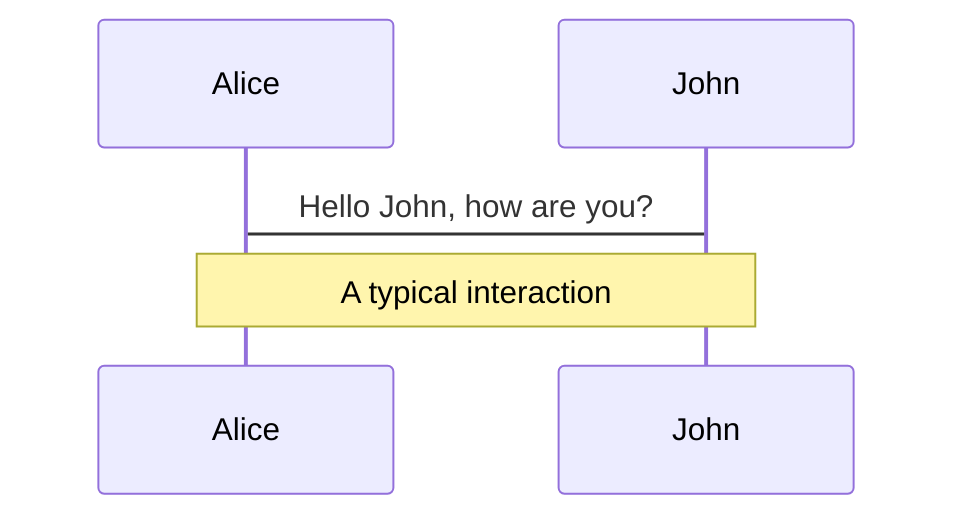
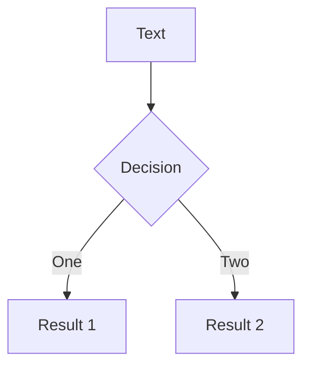
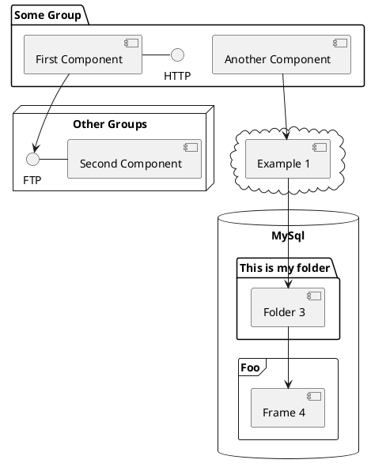

---
# try also 'default' to start simple
theme: seriph
# random image from a curated Unsplash collection by Anthony
# like them? see https://unsplash.com/collections/94734566/slidev , (/public/logo-new.gif)
background:
# apply any windi css classes to the current slide
class: 'text-center'
# https://sli.dev/custom/highlighters.html
highlighter: shiki
# show line numbers in code blocks
lineNumbers: false
# some information about the slides, markdown enabled
info: |
  ## Slidev Starter Template
  Presentation slides for developers.

  Learn more at [Sli.dev](https://sli.dev)
# persist drawings in exports and build
drawings:
  persist: false
# use UnoCSS (experimental)
css: unocss

---

[//]: # (![]&#40;/logo-new.gif&#41;)
<p align="center">

</p>

<h3><strong>Introduction to Jina</strong></h3><br>
<h5> A cloud-native neural search framework to build SOTA and scalable deep learning search applications
</h5>

---

<h3><strong>What is Cross Modal and Multi Modal?</strong></h3><br>  

<h4><strong>Types of Data Modality</strong></h4><br>

 - Single Modality -For example, a tweet is a modal of type “text”; a photo is a modal of type “image”; a video is a modal of type “video”; etc. <br>
 - Multi - Modality - For example, a tweet often contains not only text, but also images, videos, and links. A video often contains not only video frames, but also audio and text (e.g., subtitles).<br>
 - Cross - Modality - For example, learning from images and text where the images and text are not necessarily about the same thing.<br>

---

<h3><strong>Potential Applications</strong></h3><br>

 - a cross-modal machine learning algorithm could be used to automatically generate descriptions of images (e.g., for blind people)<br>
 - A search system could use a cross-modal machine learning algorithm to search for images by text queries (e.g., “find me a picture of a dog”)<br>
 - A text-to-image generation system could use a cross-modal machine learning algorithm to generate images from text descriptions (e.g., “generate an image of a dog”)<br>
 - a cross-modal system could be used to improve the accuracy of facial recognition algorithms by using information from other modalities such as body language or voice<br>
 - For example, if an image recognition algorithm is having difficulty identifying an object due to poor lighting conditions, information from another modality such as sound could be used to help identify the object<br>

---

<h3><strong>Broad Families of Cross-Modal Applications</strong></h3><br>

 - <h4><strong>Neural Search</strong></h4><br>
<h5>In short, neural search is deep neural network-powered information retrieval. In academia, it’s often called neural IR.<br>
Neural search is particularly well suited to cross-modal search tasks, because it can learn to map the features of one modality (e.g., text) to the features of another modality (e.g., images).<br> 
This enables neural search engines to search for documents and images by text queries, and to search for text documents by image queries.<br>
</h5><br>

 - <h4><strong>Creative AI</strong></h4><br>
<h5>Another potential application of cross-modal machine learning is creative AI. Creative AI systems use artificial intelligence to generate new content, such as images, videos, or text. For example, Open AI GPT3 is a machine learning platform that can generate text.<br> 
The system is trained on a large corpus of text, such as books, articles, and websites. Once trained, the system can generate new text that is similar to the training data. This can be used to generate new articles, stories, or even poems.<br>
Open AI DALLE is another example of a creative AI system. This system generates images from textual descriptions. For example, given the text “a black cat with green eyes”, the system will generate an image of a black cat with green eyes<br>
</h5>

---

<center><h3><strong>Relationship between Neural Search and Creative AI</strong></h3></center><br>

<p align="center">

</p>

<center><h5>The relationship between or within the modalities ties Neural Search and Creative AI together
</h5></center>

---

<center><h3><strong>What is Jina?</strong></h3></center><br>
<h5>Jina is the framework for helping you to build cross-modal and multi-modal systems on the cloud.
With Jina, developers can easily build high performant cloud native applications, services and systems in production
</h5><br>

<h4><strong>Why do we need Jina?</strong></h4><br>
<h5><strong>Problems of building such a system</strong></h5><br>

 - lack of design pattern for such system
 - gap between a proof-of-concept and a production system
 - long go-to-market time

Jina is a solution to address above problems by 
providing a consistent design pattern for cross-modal/multi-modal 
systems with the latest cloud native technologies.

---

<center><h3><strong>Taste of Jina</strong></h3></center><br>
```python
from jina import DocumentArray, Executor, Flow, requests

class MyExec(Executor):
    @requests
    async def foo(self, docs: DocumentArray, **kwargs):
        for d in docs:
            d.text += 'hello, world!'

f = Flow().add(uses=MyExec).add(uses=MyExec)

with f:
    r = f.post('/', DocumentArray.empty(2))
    print(r.texts)
```
```shell
────────────────────────── 🎉 Flow is ready to serve! ──────────────────────────
╭────────────── 🔗 Endpoint ───────────────╮
│  ⛓     Protocol                    GRPC  │
│  🏠       Local           0.0.0.0:52570  │
│  🔒     Private     192.168.1.126:52570  │
│  🌍      Public    87.191.159.105:52570  │
╰──────────────────────────────────────────╯

['hello, world!hello, world!', 'hello, world!hello, world!']
```

---

<center><h3><strong>Design Principles</strong></h3></center><br>

We only need to know three concepts to master Jina.
They are Document, Executor and Flow. <br>
A full-fledged cross-modal/multi-modal system is a combination of the following seven layers:<br>

<p align="center">

</p>

---

<center><h3><strong>Developer Focus</strong></h3></center><br>

<p align="center">

</p>
---

# Themes

Slidev comes with powerful theming support. Themes can provide styles, layouts, components, or even configurations for tools. Switching between themes by just **one edit** in your frontmatter:

<div grid="~ cols-2 gap-2" m="-t-2">

```yaml
---
theme: default
---
```

```yaml
---
theme: seriph
---
```


</div>

Read more about [How to use a theme](https://sli.dev/themes/use.html) and
check out the [Awesome Themes Gallery](https://sli.dev/themes/gallery.html).

---
preload: false
---

# Animations

Animations are powered by [@vueuse/motion](https://motion.vueuse.org/).

```html
<div
  v-motion
  :initial="{ x: -80 }"
  :enter="{ x: 0 }">
  Slidev
</div>
```

<div class="w-60 relative mt-6">
  <div class="relative w-40 h-40">
    
    
    
  </div>

  <div
    class="text-5xl absolute top-14 left-40 text-[#2B90B6] -z-1"
    v-motion
    :initial="{ x: -80, opacity: 0}"
    :enter="{ x: 0, opacity: 1, transition: { delay: 2000, duration: 1000 } }">
    Slidev
  </div>
</div>

<!-- vue script setup scripts can be directly used in markdown, and will only affects current page -->
<script setup lang="ts">
const final = {
  x: 0,
  y: 0,
  rotate: 0,
  scale: 1,
  transition: {
    type: 'spring',
    damping: 10,
    stiffness: 20,
    mass: 2
  }
}
</script>

<div
  v-motion
  :initial="{ x:35, y: 40, opacity: 0}"
  :enter="{ y: 0, opacity: 1, transition: { delay: 3500 } }">

[Learn More](https://sli.dev/guide/animations.html#motion)

</div>

---

# LaTeX

LaTeX is supported out-of-box powered by [KaTeX](https://katex.org/).

<br>

Inline $\sqrt{3x-1}+(1+x)^2$

Block
$$
\begin{array}{c}

\nabla \times \vec{\mathbf{B}} -\, \frac1c\, \frac{\partial\vec{\mathbf{E}}}{\partial t} &
= \frac{4\pi}{c}\vec{\mathbf{j}}    \nabla \cdot \vec{\mathbf{E}} & = 4 \pi \rho \\

\nabla \times \vec{\mathbf{E}}\, +\, \frac1c\, \frac{\partial\vec{\mathbf{B}}}{\partial t} & = \vec{\mathbf{0}} \\

\nabla \cdot \vec{\mathbf{B}} & = 0

\end{array}
$$

<br>

[Learn more](https://sli.dev/guide/syntax#latex)

---

# Diagrams

You can create diagrams / graphs from textual descriptions, directly in your Markdown.

<div class="grid grid-cols-3 gap-10 pt-4 -mb-6">







</div>

[Learn More](https://sli.dev/guide/syntax.html#diagrams)


---
layout: center
class: text-center
---

# Learn More

[Documentations](https://sli.dev) · [GitHub](https://github.com/slidevjs/slidev) · [Showcases](https://sli.dev/showcases.html)
